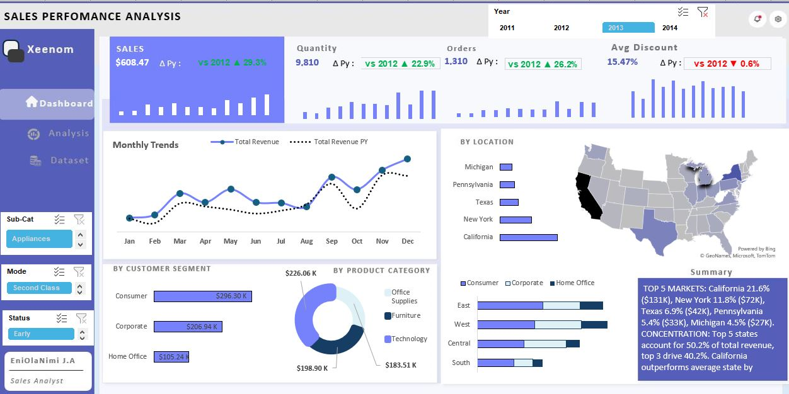

# 📈 Xeennom Sales Performance Analysis Dashboard (Power BI)

This project analyzes sales transaction data for the fictional company Xeennom, focusing on measuring year-over-year performance, identifying regional concentration risks, and detailing sales trends by product and customer segment.

## 🚀 Project Overview

The dashboard utilizes comparative analysis (Current Year vs. Previous Year - 2012) across all key metrics (Sales, Quantity, Orders, Discount) to provide immediate insight into business health.

*The project structure and approach were inspired by the work of **Daniel Nte Daniel**.*

## ✨ Key Performance Indicators (KPIs)

The analysis compares 2013 performance against 2012:

| Metric | Value (2013) | YoY Growth (vs 2012) |
| :--- | :--- | :--- |
| **Sales** | $608.47K | +23.3% |
| **Quantity** | 9,810 | +22.9% |
| **Orders** | 1,310 | +26.2% |
| **Avg Discount** | 15.47% | -0.6% |

## ⚠️ Critical Business Insights

* **Geographical Risk:** The top 5 states account for a high **50.2%** of total revenue, highlighting a critical need for market diversification.
* **Customer Focus:** The **Consumer** segment ($296.30K) is the highest revenue contributor, guiding marketing spend.
* **Seasonal Trend:** Sales exhibit clear seasonality, peaking sharply in the final quarter (Q4).

## 🛠️ Tools and Methodology

* **Primary Tool:** Microsoft Power BI Desktop
* **Calculations (DAX):** Extensive use of DAX for Year-over-Year calculations (`SAMEPERIODLASTYEAR()`), aggregation, and calculating the Average Discount.
* **Data Modeling:** Focused on connecting transaction data to various dimension tables (Customer, Product, Geography, Time).

## 📊 Dashboard Visuals

The dashboard provides a holistic view of performance:

### 1. Performance Summary
* Large KPI cards showing Sales, Quantity, Orders, and Avg Discount with YoY comparison.
* Bar charts reinforcing the absolute performance of each metric.

### 2. Trends and Segmentation
* **Monthly Trends:** Line chart comparing current year total revenue against previous year revenue.
* **By Customer Segment:** Bar chart detailing performance across Consumer, Corporate, and Home Office.
* **By Product Category:** Donut chart showing revenue breakdown by Office Supplies, Furniture, and Technology.

### 3. Geographical Analysis
* Map visual showing sales distribution across the US.
* Detailed breakdown highlighting the concentration risk, with California leading the markets.

**Main Dashboard View:**

---
**Author:** EniOlaNimi J.A 
